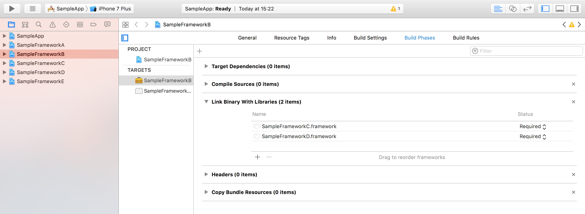
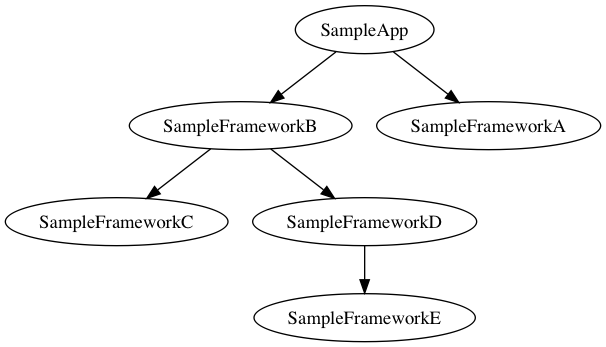

# Pandan

> Pandanus amaryllifolius is a tropical plant in the Pandanus (screwpine) genus, which is commonly known as pandan leaves, and is used widely in South Asian and Southeast Asian cooking as a flavoring.
> - [Wikipedia](https://en.wikipedia.org/wiki/Pandanus_amaryllifolius)

`pandan` is a CLI tool that outputs dependency information from a set of Xcode projects with targets that depend on each other, it does it by creating a (reverse) dependency graph using the information in "Link Binary with Libraries" build phase and doing a breadth-first search.

## Installation:

`pandan` is distributed as a Ruby gem and can be installed using the following command:

```bash
$ gem install pandan
```

## Motivation

At XING, CocoaPods helped us to manage our Objective-C and Swift dependencies for a long time. But as our team grew, it was evident to us that CocoaPods was not tool we needed anymore. We decided to migrate all our projects to different setup that uses multiple Xcode projects, targets and xcconfig files under a single workspace, but we were lacking a tool that would give us dependency information out of the settings that are already in place in Xcode.

## Usage

Given the following project setup:



where additionally to this, SampleFrameworkD links against SampleFrameworkE:

```bash
$ pandan query SampleFrameworkB # will output:
SampleFrameworkC
SampleFrameworkE
SampleFrameworkD
```

You can generate a complete dependency graph of your workspace that is output as a PNG image. It's a good idea to exclude targets with names ending in "Tests" for a more tidy graph:

```bash
$ pandan dependency-graph --image --filter='^(?!.*Tests$).*$'
```



For a complete and up-to-date usage description, execute:

```bash
$ pandan --help
```
